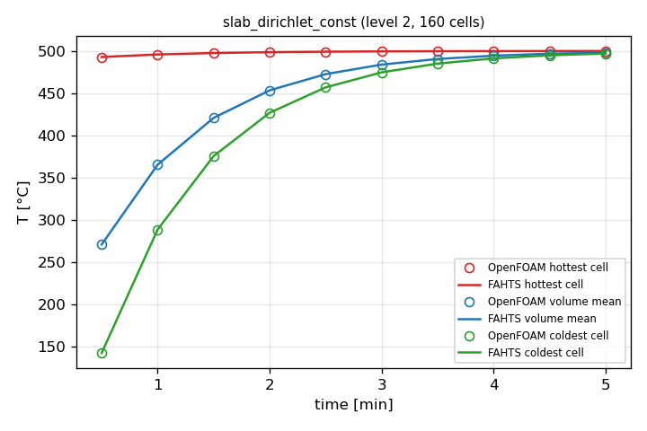
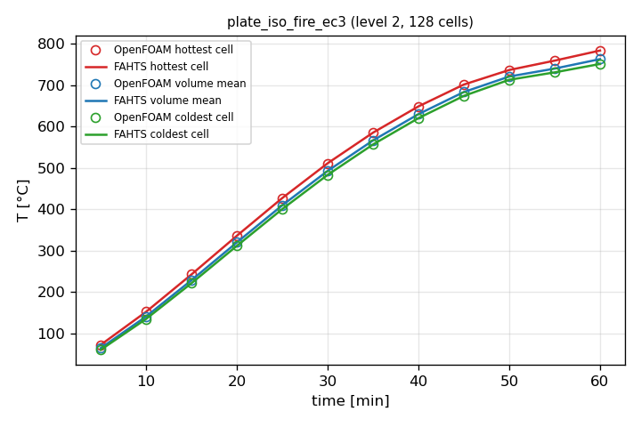
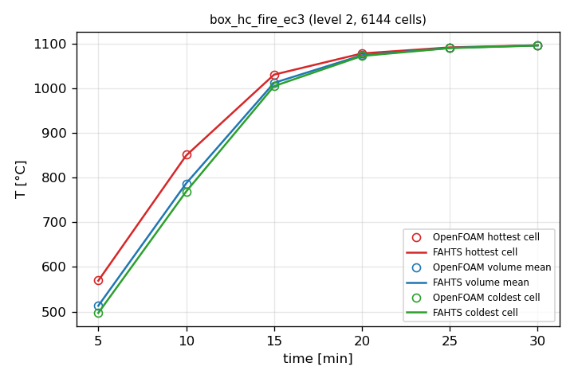
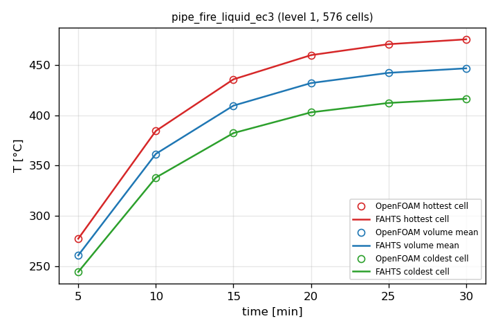
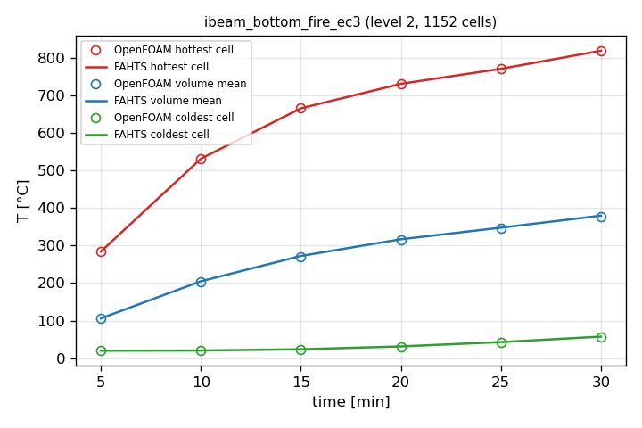
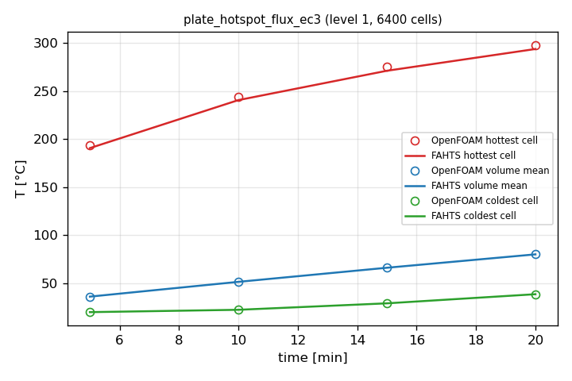

# FAHTS 3-D solver vs OpenFOAM solidFoam — code-to-code comparison

Same Hex8 mesh (one FV cell per hex), same BCs, same tabulated material data (EN 1993-1-2 on a 1 °C grid or constant), same initial state (20 °C), same Δt.
FEM cell value = mean of the 8 nodal temperatures; compared with the FV cell value.
FAHTS conduction scheme: **monotone**.  OpenFOAM v2412 `solidFoam`, Crank–Nicolson 0.9, `externalWallHeatFluxTemperature` (h + εσ(Ta⁴−T⁴), identical formula).  σ: FAHTS 5.67e-8, OpenFOAM 5.670374e-8.

FV values live at cell centres, FEM values at nodes: comparing at cell centres adds an interpolation error (the 8-node mean of a curved profile) that belongs to neither solver.  For the exact-solution case the FEM error is therefore also reported at its own nodes.

**Fire/convection BC in OpenFOAM:** the built-in `externalWallHeatFluxTemperature` (mode coefficient) is a *mixed* T condition, which `heSolidThermo` converts to enthalpy with refValue = h(Ta).  With a temperature-dependent Cp this makes the wall flux ≈ c̄p(T_wall→Ta)/cp(T_wall) × the true flux (+17–22 % for EN 1993 steel in a fire; exact for constant Cp — verified against a lumped-capacitance ODE).  All Robin conditions are therefore imposed as a flux q = h(Ta−T) + εσ(Ta⁴−T⁴) from the current face temperature (`codedMixed`, valueFraction 0), which OpenFOAM converts correctly.

**Pass criterion:** max |FEM − FV| ≤ 2 % of the temperature rise on the finest mesh AND the difference decreases with refinement (both codes converge to the same answer).

## Summary

| Case | cells (finest) | ΔT rise [K] | max \|Δ\| per level [K] | ratio | max \|Δ\|/rise | Result |
|---|---|---|---|---|---|---|
| slab_dirichlet_const | 160 | 480 | 2.15 / 0.565 / 0.171 | 3.8× → 3.3× | 0.04% | PASS |
| plate_iso_fire_ec3 | 128 | 764 | 0.257 / 0.21 / 0.144 | 1.2× → 1.5× | 0.02% | PASS |
| box_hc_fire_ec3 | 6144 | 1077 | 20.9 / 6.97 / 2.1 | 3.0× → 3.3× | 0.19% | PASS |
| pipe_fire_liquid_ec3 | 576 | 455 | 0.235 / 0.0677 | 3.5× | 0.01% | PASS |
| ibeam_bottom_fire_ec3 | 1152 | 799 | 110 / 60 / 31.3 | 1.8× → 1.9× | 3.92% | FAIL |
| plate_hotspot_flux_ec3 | 6400 | 278 | 16.2 / 5.8 | 2.8× | 2.09% | FAIL |

## Cases

### slab_dirichlet_const

40 mm slab, face at 500 °C, back adiabatic, constant k/c

| level | cells | max \|Δ\| [K] | RMS Δ final [K] | Δ vol-mean final [K] | FEM err @cell centres [K] | FEM err @nodes [K] | FV err @cell centres [K] | time FAHTS / OF [s] |
|---|---|---|---|---|---|---|---|---|
| 0 | 40 | 2.146 | 0.01613 | 0.01454 | 1.518 | 0.4679 | 0.7328 | 0.4 / 0.6 |
| 1 | 80 | 0.5651 | 0.006057 | 0.005455 | 0.3786 | 0.114 | 0.2272 | 0.4 / 0.6 |
| 2 | 160 | 0.1705 | 0.003561 | 0.003206 | 0.09244 | 0.02614 | 0.1005 | 0.5 / 0.6 |

### plate_iso_fire_ec3

40 mm plate, ISO 834 fire on one face (h=25, ε=0.7), EC3 steel

| level | cells | max \|Δ\| [K] | RMS Δ final [K] | Δ vol-mean final [K] | time FAHTS / OF [s] |
|---|---|---|---|---|---|
| 0 | 32 | 0.2569 | 0.1358 | 0.1207 | 1.2 / 4.9 |
| 1 | 64 | 0.2103 | 0.0545 | 0.05158 | 1.4 / 5.0 |
| 2 | 128 | 0.1441 | 0.05321 | 0.05252 | 1.9 / 5.2 |

### box_hc_fire_ec3

BOX 300×300×12, 1 m, HC fire outside (h=50, ε=0.7), cavity+ends adiabatic, EC3

| level | cells | max \|Δ\| [K] | RMS Δ final [K] | Δ vol-mean final [K] | time FAHTS / OF [s] |
|---|---|---|---|---|---|
| 0 | 96 | 20.91 | 0.06785 | 0.04409 | 0.8 / 4.4 |
| 1 | 768 | 6.969 | 0.02236 | 0.0123 | 1.4 / 5.0 |
| 2 | 6144 | 2.098 | 0.006725 | 0.00392 | 6.9 / 9.9 |

### pipe_fire_liquid_ec3

Pipe Ø300×15, HC fire outside (h=50, ε=0.8), liquid inside (h=500, 20 °C), EC3

| level | cells | max \|Δ\| [K] | RMS Δ final [K] | Δ vol-mean final [K] | time FAHTS / OF [s] |
|---|---|---|---|---|---|
| 0 | 144 | 0.2353 | 0.1507 | 0.1503 | 0.8 / 8.2 |
| 1 | 576 | 0.06768 | 0.03691 | 0.0368 | 1.2 / 8.5 |

### ibeam_bottom_fire_ec3

I 300×150, ISO 834 on bottom flange only (h=25, ε=0.7), rest adiabatic, EC3

| level | cells | max \|Δ\| [K] | RMS Δ final [K] | Δ vol-mean final [K] | time FAHTS / OF [s] |
|---|---|---|---|---|---|
| 0 | 72 | 110.4 | 30.83 | 13.69 | 0.8 / 4.4 |
| 1 | 288 | 59.96 | 13.32 | 5.305 | 1.3 / 4.6 |
| 2 | 1152 | 31.3 | 5.926 | 2.227 | 2.9 / 5.4 |

### plate_hotspot_flux_ec3

Plate 500×500×20, 100 kW/m² on a 100×100 spot, back face h=10 to 20 °C, EC3

| level | cells | max \|Δ\| [K] | RMS Δ final [K] | Δ vol-mean final [K] | time FAHTS / OF [s] |
|---|---|---|---|---|---|
| 0 | 800 | 16.17 | 3.085 | 0.09292 | 0.7 / 4.6 |
| 1 | 6400 | 5.798 | 0.8049 | 0.02375 | 3.7 / 7.2 |

