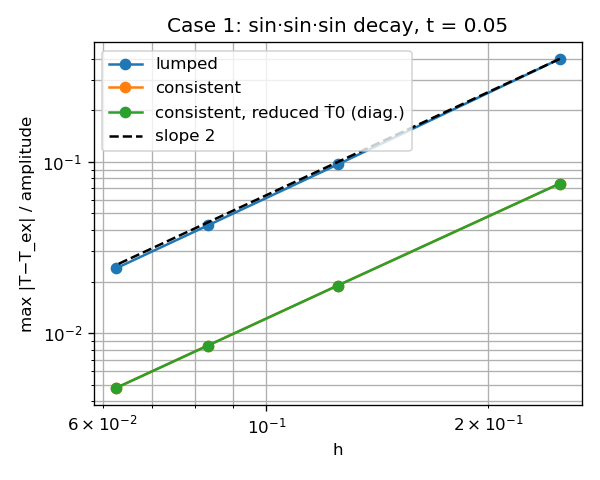
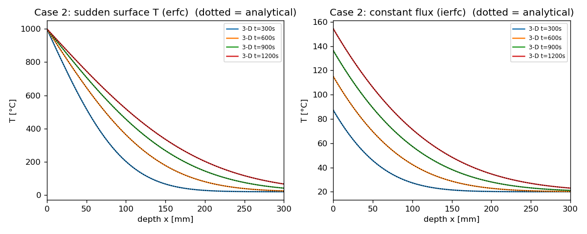
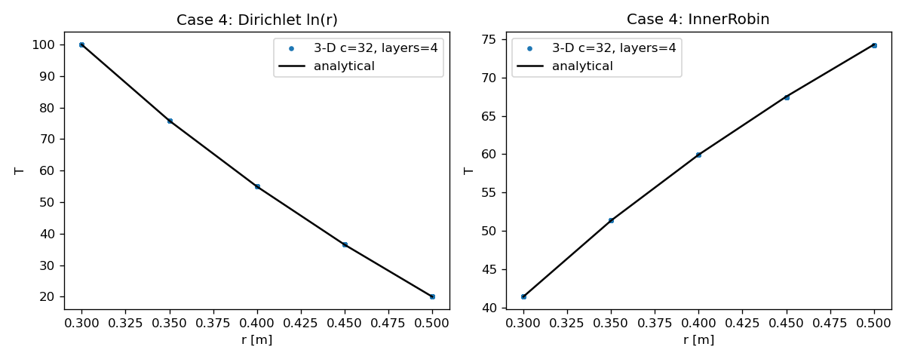
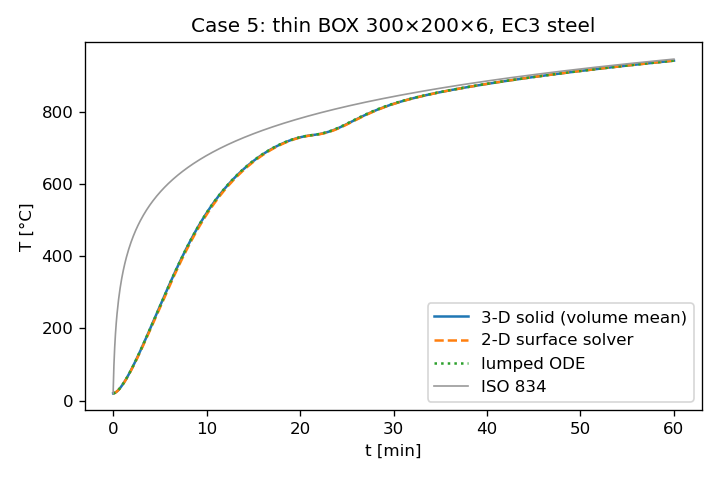
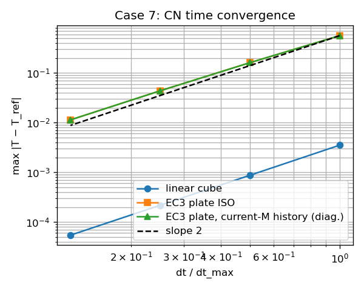
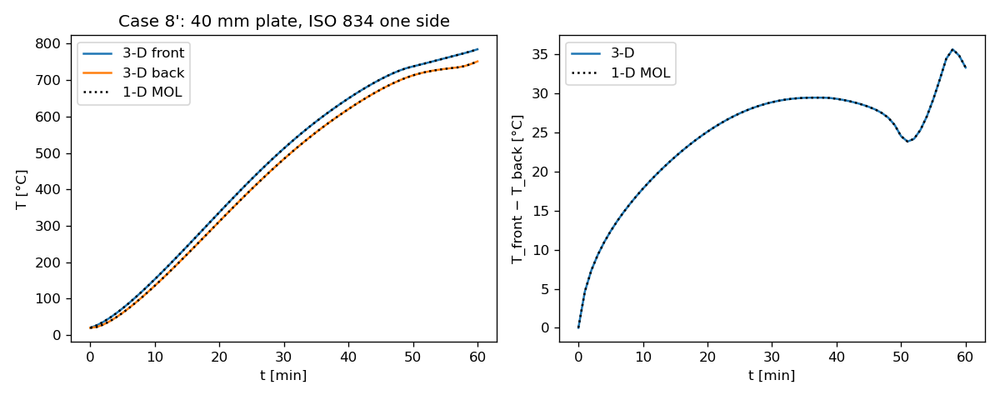

# 3-D Hex8 solver validation report (WP-D)

Generated by `python -m validation.validate_3d`.  Solver: `fahts/core/heat/solver/solid_solver.py` (`SolidTransientSolver`, CN θ=½).

| Case | Metric | Value | Tolerance | Result |
|---|---|---|---|---|
| 1 cube decay | lumped: max rel err n=4 | 0.3989 | — | info |
| 1 cube decay | lumped: max rel err n=8 | 0.09651 | — | info |
| 1 cube decay | lumped: max rel err n=12 | 0.04254 | — | info |
| 1 cube decay | lumped: max rel err n=16 | 0.02385 | — | info |
| 1 cube decay | lumped: max rel err n=16 | 0.02385 | <= 0.03 | PASS |
| 1 cube decay | lumped: observed order Linf (finest pair) | 2.012 | >= 1.8 | PASS |
| 1 cube decay | lumped: observed order RMS (finest pair) | 1.911 | >= 1.8 | PASS |
| 1 cube decay | consistent: max rel err n=4 | 0.07465 | — | info |
| 1 cube decay | consistent: max rel err n=8 | 0.01897 | — | info |
| 1 cube decay | consistent: max rel err n=12 | 8.466e-03 | — | info |
| 1 cube decay | consistent: max rel err n=16 | 4.778e-03 | — | info |
| 1 cube decay | consistent: max rel err n=16 | 4.778e-03 | <= 0.01 | PASS |
| 1 cube decay | consistent: observed order Linf (finest pair) | 1.988 | — | info |
| 1 cube decay | consistent: observed order RMS (finest pair) | 1.887 | — | info |
| 1 cube decay | consistent, diagnostic reduced-Ṫ0: order Linf (finest pair) | 1.988 | >= 1.8 | PASS |
| 1 cube decay | consistent n=8: err spread over Δt=T/25…T/400 (library) | 4.395e-04 | <= 1.000e-03 | PASS |
| 1 cube decay | consistent n=8: same with reduced-system Ṫ0 (diag.) | 4.395e-04 | <= 1.000e-03 | PASS |
| 2 semi-inf Dirichlet | max |err|/(Ts−Ti), t≥300 s, h=2.5 mm | 7.464e-05 | <= 0.01 | PASS |
| 2 semi-inf Dirichlet | same, h=5 mm | 1.174e-04 | — | info |
| 2 semi-inf flux | max |err|/ΔT_surf, t≥300 s, h=2.5 mm | 1.360e-04 | <= 5.000e-03 | PASS |
| 2 semi-inf flux | same, h=5 mm | 5.442e-04 | — | info |
| 2 semi-inf | domain depth / 4√(αt_end) | 1.401 | >= 1 | PASS |
| 3 steady wall Dirichlet | max |err| / ΔT | 3.020e-15 | <= 1.000e-09 | PASS |
| 3 steady wall Robin | max |err| / ΔT_f | 7.994e-15 | <= 1.000e-09 | PASS |
| 4 pipe Dirichlet ln(r) | max rel err c=16, layers=2 | 6.708e-04 | — | info |
| 4 pipe InnerRobin series-R | max rel err c=16, layers=2 | 3.302e-03 | — | info |
| 4 pipe Dirichlet ln(r) | max rel err c=32, layers=4 | 1.728e-04 | — | info |
| 4 pipe InnerRobin series-R | max rel err c=32, layers=4 | 8.270e-04 | — | info |
| 4 pipe Dirichlet ln(r) | max rel err c=64, layers=8 | 4.543e-05 | — | info |
| 4 pipe InnerRobin series-R | max rel err c=64, layers=8 | 2.069e-04 | — | info |
| 4 pipe Dirichlet ln(r) | max rel err c=128, layers=16 | 1.138e-05 | — | info |
| 4 pipe InnerRobin series-R | max rel err c=128, layers=16 | 5.172e-05 | — | info |
| 4 pipe Dirichlet ln(r) | max rel err finest | 1.138e-05 | <= 1.000e-03 | PASS |
| 4 pipe Dirichlet ln(r) | observed order (finest pair) | 1.997 | >= 1.8 | PASS |
| 4 pipe InnerRobin series-R | max rel err finest | 5.172e-05 | <= 1.000e-03 | PASS |
| 4 pipe InnerRobin series-R | observed order (finest pair) | 2 | >= 1.8 | PASS |
| 5 thin BOX ISO834 | max |T̄3D − T_lumped| [°C] | 1.144 | <= 5 | PASS |
| 5 thin BOX ISO834 | max |T̄3D − T̄2D| [°C] | 5.017 | <= 20 | PASS |
| 5 thin BOX ISO834 | max |T̄2D − T_lumped| [°C] | 5.659 | — | info |
| 5 thin BOX ISO834 | max 3-D spread in section [°C] | 16.56 | — | info |
| 5 thin BOX ISO834 | 2-D steel area / exact | 1.025 | — | info |
| 6 energy | const props, flux, lumped: rel err | 1.223e-13 | <= 1.000e-10 | PASS |
| 6 energy | const props, flux, consistent: rel err | 3.844e-13 | <= 1.000e-10 | PASS |
| 6 energy | EC3 props, flux, dt=5: rel err | 7.081e-04 | <= 0.01 | PASS |
| 6 energy | EC3 props, flux, dt=1: rel err | 9.353e-04 | <= 0.01 | PASS |
| 6 energy | const props, ISO fire h+rad: rel err | 1.350e-11 | <= 1.000e-06 | PASS |
| 6 energy | EC3 props, ISO fire h+rad: rel err | 1.281e-03 | <= 0.01 | PASS |
| 7 CN time order | linear cube: order (finest pair) | 2.002 | >= 1.8 | PASS |
| 7 CN time order | EC3 plate ISO fire: order (finest pair) | 1.946 | >= 1.8 | PASS |
| 7 CN time order | EC3 plate, diagnostic CN with B=Q−K_i T_(i−1)+M_i Ṫ_(i−1) | 1.946 | >= 1.8 | PASS |
| 7 CN time order | order (finest pair), const k,c + radiation | 1.943 | — | info |
| 7 CN time order | order (finest pair), k(T) only, convection | 1.925 | — | info |
| 7 CN time order | order (finest pair), c(T) only, convection | 1.926 | — | info |
| 7 CN time order | order (finest pair), EC3 k(T),c(T) + radiation | 1.946 | — | info |
| 8' 40 mm plate vs 1-D MOL | max |ΔT_front| [°C] (nx=32) | 0.01011 | <= 3 | PASS |
| 8' 40 mm plate vs 1-D MOL | max |ΔT_back| [°C] (nx=32) | 5.707e-03 | <= 3 | PASS |
| 8' 40 mm plate vs 1-D MOL | max |err in ΔT across| [°C] (nx=32) | 9.209e-03 | <= 3 | PASS |
| 8' 40 mm plate vs 1-D MOL | max |err in ΔT across| [°C] (nx=16) | 0.0494 | — | info |
| 8' 40 mm plate vs 1-D MOL | peak ΔT across thickness [°C] (ref) | 35.67 | — | info |

## Observed convergence orders

- Case 1 lumped orders (Linf): 2.047, 2.020, 2.012; (RMS): 1.819, 1.881, 1.911
- Case 1 consistent orders (Linf): 1.977, 1.989, 1.988; (RMS): 1.749, 1.850, 1.887
- Case 1 consistent + diagnostic reduced-system Ṫ0 orders (Linf): 1.977, 1.989, 1.988
- Case 1 consistent n=8 error vs steps [25, 50, 100, 200, 400]: library 0.01938, 0.01905, 0.01897, 0.01895, 0.01894; reduced Ṫ0 0.01938, 0.01905, 0.01897, 0.01895, 0.01894 (reduced free-DOF Ṫ0 in the library since 2026-09-27; was O(Δt) before).
- Case 4 orders (refining c_circ and n_layers together): Dirichlet 1.957, 1.927, 1.997; InnerRobin 1.997, 1.999, 2.000
- Case 5: the 3-D section spread (~15 °C at t≈8 min, mesh-converged ≈16.5 °C) sits at the four outer corners (double exposed perimeter per steel volume); away from the corners the spread is ≈6 °C (through-thickness q·t/2k plus hoop).  The 2-D solver models the wall at the outer perimeter with steel area P·t, 2.5 % too large → slower heating.
- Case 6 EC3 flux: T range after 900 s = 779–1123 °C (crosses the 735 °C c(T) peak).  With constant properties the balance is exact to round-off; the EC3 residual (~0.1 %) has an O(Δt) part from the lagged M_(i−1) history term (see Case 7) and a Δt-independent part because c is evaluated at the hex-mean T while the reference enthalpy uses nodal T.
- Case 7 diagnostic (validation-only subclass, now identical to the library CN form): orders 1.804, 1.880, 1.946
- Case 7 orders: linear 2.012, 2.003, 2.002 (dt = 0.0125, 0.00625, 0.003125, 0.001563); nonlinear 1.804, 1.880, 1.946 (dt = 60, 30, 15, 7.5 s)

## Case 8' — through-thickness temperature difference (40 mm plate)

| t [min] | ΔT 3-D [°C] | ΔT 1-D ref [°C] |
|---|---|---|
| 10 | 17.8 | 17.8 |
| 20 | 25.1 | 25.1 |
| 30 | 28.9 | 28.9 |
| 40 | 29.3 | 29.3 |
| 50 | 24.5 | 24.5 |
| 60 | 33.3 | 33.3 |

## Runtime

- case1: 5.7 s
- case2: 2.6 s
- case3: 0.7 s
- case4: 1.7 s
- case5: 1.2 s
- case6: 1.9 s
- case7: 13.5 s
- case8: 5.7 s
- total: 32.8 s

## Figures

